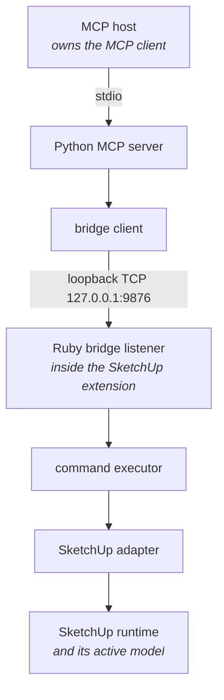

# SketchUp MCP

**Drive SketchUp from an AI assistant.** Create geometry, cut real joinery, apply
materials, and read the live model — by asking for it in plain language.

[](https://github.com/coral-garden/sketchup-mcp/actions/workflows/verification.yml)
[](https://www.python.org/downloads/)
[](LICENSE)

SketchUp MCP lets an MCP host inspect and modify the active model in SketchUp
Desktop. It combines a Python MCP server with a SketchUp extension; both must run
on the same computer for a tool call to reach the model.

**Contents** — [What you can ask for](#what-you-can-ask-for) ·
[Runtime topology](#runtime-topology) · [Prerequisites](#prerequisites) ·
[Install and verify](#install-and-verify) · [Public tools](#public-tools) ·
[Troubleshooting](#troubleshooting) · [Security](#security)

## What you can ask for

Once the bridge is running, these are ordinary prompts to your MCP host:

| Ask | What happens |
| --- | --- |
| *"Add a 24 by 24 by 2 cube at the origin."* | A grouped primitive appears in the model |
| *"What do I have selected?"* | The current selection is read back to you |
| *"Move that panel up 8 and rotate it 90 degrees about z."* | The entity is transformed in place |
| *"Make the selected part brown."* | A named or hexadecimal color is applied |
| *"Cut a dovetail between these two boards."* | Matching tails and pins are cut into both |
| *"Union the cylinder and the block, deleting the originals."* | A new solid replaces the pair |
| *"Export the model as STL."* | The model is written to a temporary file |

**Two things to say explicitly when you ask.** Sizes and positions are plain
numbers in **model units**, not millimetres or inches — a request for "600 mm"
becomes 600 model units. And materials must be an existing model material, a
`#RRGGBB` value, or one of the common color names (`red`, `green`, `blue`,
`yellow`, `cyan`/`turquoise`, `magenta`/`purple`, `white`, `black`, `brown`,
`orange`, `gray`/`grey`); anything else returns `Material not found`.

Boolean operations keep both source entities unless you ask for the originals to
be deleted. Rotations are degrees about the x, y, and z axes.

Joinery is real geometry, not a sketch: the mortise-and-tenon, dovetail, and
finger-joint tools cut matching profiles into both boards and leave each one a
solid. Every tool is listed under [Public tools](#public-tools) below, and there
is a trusted-Ruby escape hatch for anything the catalog does not cover — read
[Security](#security) before you use it.

## Runtime topology

The names below are separate runtime roles. A request travels through them in
this order:



The MCP host owns the MCP client and launches the Python MCP server over stdio.
The bridge client then opens one loopback connection per command. Inside the
SketchUp extension, the extension runtime owns the Ruby bridge listener, which
hands the command to the executor and adapter that use the live SketchUp model.

Because the bridge is loopback-only at `127.0.0.1`, the MCP host and SketchUp must
run on the same machine. Running all components under one intended account is
operationally simplest, but the TCP bridge does not enforce an account identity.

## Prerequisites

- **SketchUp Desktop** for macOS or Windows, with permission to install an RBZ.
- **Git** and **Python 3.10+** — `python --version` must resolve to that Python.
- **[`uv`](https://docs.astral.sh/uv/getting-started/installation/)** for the
  isolated Python environment.
- **An MCP host** that can launch a local stdio server. The verified example below
  uses Claude Desktop; its configuration flow follows the
  [official local-server guide](https://modelcontextprotocol.io/docs/develop/connect-local-servers).

The path below installs both sides from one successful `main` build or reproduces
that build from one clean checkout, so their project version and command catalog
cannot drift. It depends on no unversioned package and no unverified binary.

## Install and verify

Six steps, in order. Step 6 proves the whole path end to end.

### 1. Download or build version 1.6.1

Every successful push to `main` uploads an Actions artifact named
`main-build-<full-commit-sha>`. Download it from that commit's successful
**Verification** run, extract it into `dist/`, check out the same full commit,
and verify the package bytes:

```sh
cd dist
sha256sum --check SHA256SUMS
cd ..
python scripts/build.py --check dist/sketchup-mcp-1.6.1.rbz
```

All checks must pass. The artifact contains the RBZ plus the MCP server wheel and
source distribution built from that same commit.

To reproduce the packages instead, start from a clean checkout:

```sh
git clone https://github.com/coral-garden/sketchup-mcp.git
cd sketchup-mcp
git status --short
python -c "from pathlib import Path; assert Path('VERSION').read_text().strip() == '1.6.1'"
```

`git status --short` must print nothing. Build the extension package and Python
distributions, then ask the same builder to validate the RBZ layout, bytes,
version, and load paths:

```sh
uv sync --locked --python 3.10 --group build
python scripts/build.py --output-dir dist
python scripts/build.py --check dist/sketchup-mcp-1.6.1.rbz
uv build --offline --no-build-isolation --out-dir dist
```

The builder prints `Built dist/sketchup-mcp-1.6.1.rbz`, `Version: 1.6.1`, and
the RBZ SHA-256. **Keep that digest with the file you install.**

### 2. Install the extension in SketchUp

1. Open **Extensions > Extension Manager** in SketchUp.
2. Click **Install Extension** and choose `dist/sketchup-mcp-1.6.1.rbz` from the
   checkout.
3. Accept SketchUp's third-party warning only if you trust this checkout.
4. Confirm **SketchUp MCP** is enabled and shows version `1.6.1`.
5. Completely quit and reopen SketchUp, so a previous extension load cannot remain
   in memory.

These steps follow SketchUp's
[official manual RBZ installation instructions](https://help.sketchup.com/en/extension-warehouse/installing-trial-extension).

### 3. Start the bridge listener

In SketchUp choose **Extensions > SketchUp MCP > Start Bridge**. Open the Ruby
Console and confirm both role-specific messages appear:

```text
SketchUp MCP: Bridge listener: listening on 127.0.0.1:9876
SketchUp MCP: Extension runtime: bridge started
```

Leave SketchUp and the model open. **Stop Bridge** intentionally makes every MCP
tool call fail until **Start Bridge** is chosen again.

### 4. Install the Python MCP server

Create a private environment and install the exact wheel paired with the RBZ:

```sh
uv venv --python 3.12
uv pip install --python .venv dist/sketchup_mcp-1.6.1-py3-none-any.whl
```

Confirm the installed Python MCP server has the same project version:

```sh
.venv/bin/python -c "import sketchup_mcp; assert sketchup_mcp.__version__ == '1.6.1'"
```

On Windows, run the equivalent executable at `.venv\Scripts\python.exe`. Do not
leave `sketchup-mcp` running in a terminal: the MCP host launches it and owns its
stdio connection in the next step.

### 5. Configure and restart Claude Desktop

In Claude Desktop open **Settings > Developer > Edit Config**. This edits
`~/Library/Application Support/Claude/claude_desktop_config.json` on macOS or
`%APPDATA%\Claude\claude_desktop_config.json` on Windows. Merge one of the
following `sketchup` entries into any existing `mcpServers` object and replace
`you` with the real checkout path. The `command` must be an absolute path.

macOS:

```json
{
  "mcpServers": {
    "sketchup": {
      "command": "/Users/you/Code/sketchup-mcp/.venv/bin/sketchup-mcp",
      "args": []
    }
  }
}
```

Windows:

```json
{
  "mcpServers": {
    "sketchup": {
      "command": "C:\\Users\\you\\Code\\sketchup-mcp\\.venv\\Scripts\\sketchup-mcp.exe",
      "args": []
    }
  }
}
```

Save valid JSON, completely quit Claude Desktop, and reopen it. A window reload is
not enough: the full restart makes the MCP host launch the Python MCP server. Open
**Manage connectors**, select `sketchup`, and confirm `get_selection` is in the
tool list.

### 6. Prove the full path with `get_selection`

Clear the SketchUp selection, keep the bridge running, and ask the MCP host:

> Use the SketchUp MCP `get_selection` tool once. Show its raw result and do not
> modify the model.

The MCP tool's text should decode to this success envelope:

```json
{
  "content": [
    {
      "type": "text",
      "text": "{\"entities\":[]}"
    }
  ],
  "isError": false,
  "success": true
}
```

`"entities":[]` is the expected command result for an empty selection. Receiving it
proves that tool discovery and stdio reached the Python MCP server, the bridge
client reached the Ruby bridge listener, and the executor and adapter read the
live SketchUp model. If you intentionally leave something selected, a non-empty
`entities` array is also a successful full-path result.

## Public tools

<!-- command-catalog:start -->
* `create_component` - Create a grouped primitive in the active SketchUp model.
* `delete_component` - Delete one entity from the active SketchUp model.
* `transform_component` - Move, rotate, or scale an entity in the active SketchUp model.
* `get_selection` - List the entities currently selected in SketchUp.
* `set_material` - Apply a named material or hexadecimal color to an entity.
* `export_scene` - Export the active model to a temporary file.
* `boolean_operation` - Create the union, difference, or intersection of two grouped entities.
* `create_mortise_tenon` - Create a mortise and matching tenon between two boards.
* `create_dovetail` - Create matching dovetail tails and pins between two boards.
* `create_finger_joint` - Create matching fingers and slots between two boards.
* `eval_ruby` - Evaluate trusted local Ruby source in SketchUp's top-level binding. Snippets must not manage SketchUp operations.
<!-- command-catalog:end -->

The [command catalog](docs/command-catalog.md) defines the arguments, results,
failure semantics, and compatibility aliases for this list.

## Troubleshooting

Each symptom names the one role responsible, so you can look in a single place.

| Symptom | Responsible role | Check and action |
| --- | --- | --- |
| The `sketchup` connector or tools are absent. | MCP host / MCP client | Validate the Claude Desktop JSON and absolute executable path, then completely restart the app. Check `mcp.log` and `mcp-server-sketchup.log` under `~/Library/Logs/Claude` on macOS or `%APPDATA%\Claude\logs` on Windows. |
| The connector starts and immediately disconnects, with an import or executable error. | Python MCP server | Run the version-check command from step 4. If it fails, repeat `uv pip install --python .venv .` and make the configured `command` point to that environment. |
| Tools are visible, but a call says `SketchUp bridge unavailable at 127.0.0.1:9876 after 3 attempts`. | bridge client | The stdio server is healthy but cannot reach the expected loopback port. In SketchUp choose **Start Bridge**, then check that both processes use the same port. |
| **Start Bridge** reports that the port is in use, or no `Bridge listener:` line appears. | Ruby bridge listener | Read the SketchUp Ruby Console, stop the process already using the port, and start the bridge again. If the port must change, follow the shared-port rule below. |
| The menu is absent, the displayed extension version is wrong, or `Extension runtime:` reports startup failure. | extension runtime | In Extension Manager enable version `1.6.1`, remove conflicting copies, completely quit SketchUp, reopen it, and inspect the Ruby Console. |
| The bridge responds but a modeling command fails. | SketchUp runtime | Check the active model, selection, entity IDs, and SketchUp edition support. The Ruby Console separates `Command executor:` failures from SketchUp API errors; retry only after resolving that model-level cause. |

Claude Desktop's official guide documents the
[configuration paths, restart requirement, and MCP logs](https://modelcontextprotocol.io/docs/develop/connect-local-servers#troubleshooting).

## Security

> **Read this before exposing the bridge to anything you do not control.**

The bridge binds only to `127.0.0.1`, which limits network access to the local
machine but does not verify the connecting operating-system account. It has no
application authentication or peer-credential check. Any local process or user
able to connect to the port can invoke public commands while the bridge listener
is running. Loopback also means this setup does not connect a remote MCP host,
container, or virtual machine to SketchUp.

`eval_ruby` evaluates trusted local Ruby in SketchUp. It can alter the model and
exercise the permissions of the SketchUp process. Review tool approvals and do not
expose it to untrusted prompts, source, or users.

Both processes read `SKETCHUP_MCP_BRIDGE_PORT`; the default is `9876`. If a port
change is unavoidable, set the same value in the SketchUp process environment
before starting SketchUp and in the Python MCP server's Claude Desktop
configuration, for example with an `env` member containing
`"SKETCHUP_MCP_BRIDGE_PORT": "19876"`. Changing only one side breaks the bridge.
The fixed loopback host cannot be configured.

The connection lifecycle and trust decision are recorded in
[ADR 0001](docs/adr/0001-local-one-request-bridge-lifecycle.md).

Automated verification stops at the hosted Python and headless Ruby boundary.
Before making a release decision, a human installs the exact RBZ and wheel from
one successful main build, runs the production-adapter TestUp suite, and confirms
an empty `get_selection` result through the configured MCP host. See the
[manual SketchUp acceptance checklist](docs/testing/sketchup-testup.md).

## Project documentation

| Document | What it covers |
| --- | --- |
| [Domain language](CONTEXT.md) | The glossary every runtime role is named from |
| [Public command catalog](docs/command-catalog.md) | Arguments, results, and failure semantics |
| [Contributor workflow](CONTRIBUTING.md) | Setup, suites, packaging, and main builds |
| [Verification and builds](docs/testing/verification.md) | Automated boundaries and artifacts |
| [Manual SketchUp acceptance](docs/testing/sketchup-testup.md) | TestUp and end-to-end desktop checks |
| [ADR 0001](docs/adr/0001-local-one-request-bridge-lifecycle.md) | Bridge lifecycle and trust decision |

## License

MIT
